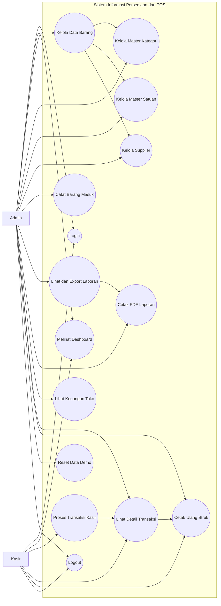
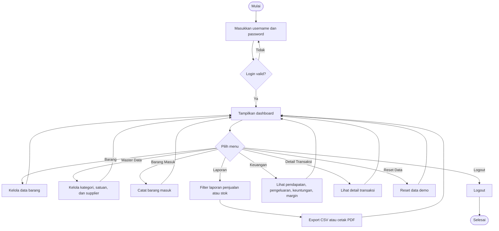
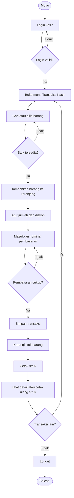
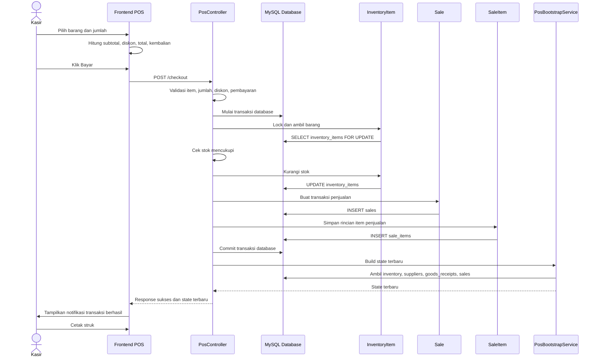
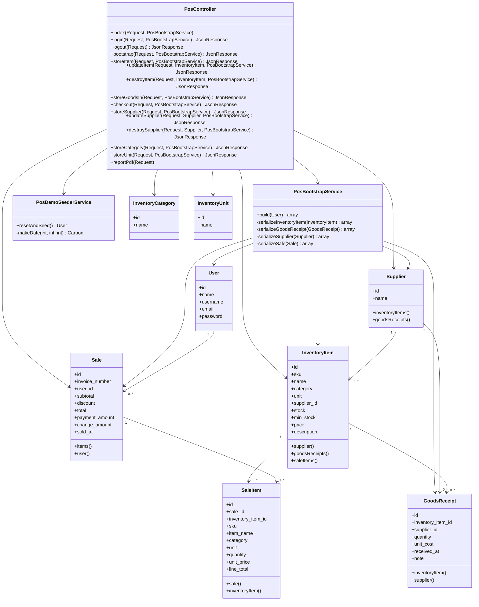
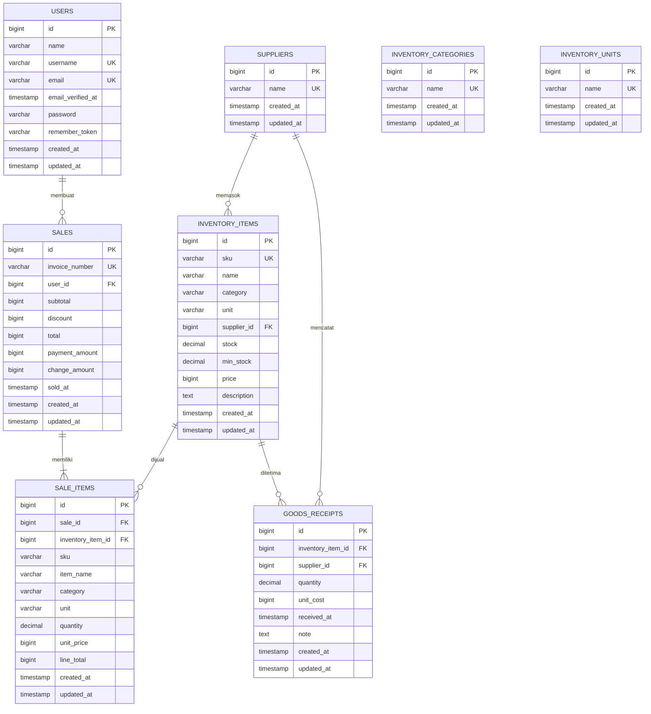

# Dokumentasi Diagram dan Implementasi Database

Dokumen ini dibuat berdasarkan struktur program POS TB. Losari Jaya 2 pada folder `laravel-app`. Diagram ditulis menggunakan format Mermaid agar dapat dirender di Markdown viewer yang mendukung Mermaid, seperti VS Code dengan extension Mermaid atau GitHub.

## 1. Use Case Diagram

Aktor utama pada sistem adalah Admin dan Kasir. Pada implementasi program saat ini keduanya memakai akun login yang sama, tetapi pembagian aktor berikut dibuat berdasarkan fungsi kerja agar sesuai kebutuhan analisis sistem.



## 2. Activity Diagram Admin

Activity diagram admin menggambarkan aktivitas pengelolaan data master, stok, laporan, dan keuangan toko.



## 3. Activity Diagram Kasir

Activity diagram kasir menggambarkan aktivitas penjualan, pembayaran, dan cetak struk.



## 4. Sequence Diagram

Sequence diagram berikut menggambarkan proses transaksi penjualan dari kasir sampai data tersimpan dan stok diperbarui.



## 5. Class Diagram

Class diagram berikut menggambarkan class utama Laravel yang digunakan pada program.



## 6. ERD Database

ERD berikut menampilkan tabel inti program. Tabel `inventory_categories` dan `inventory_units` menjadi master pilihan, sedangkan nilai kategori dan satuan juga disimpan sebagai teks pada `inventory_items` dan `sale_items` agar riwayat transaksi tetap aman walaupun master berubah.



## 7. Implementasi Database MySQL

### 7.1 Konfigurasi `.env`

Contoh konfigurasi MySQL yang digunakan Laravel:

```env
DB_CONNECTION=mysql
DB_HOST=127.0.0.1
DB_PORT=3306
DB_DATABASE=tb_losari_jaya_2
DB_USERNAME=root
DB_PASSWORD=
```

Perintah pembuatan database:

```sql
CREATE DATABASE tb_losari_jaya_2
CHARACTER SET utf8mb4
COLLATE utf8mb4_unicode_ci;
```

Perintah menjalankan migration dan data demo:

```bash
php artisan migrate
php artisan db:seed
```

### 7.2 DDL Tabel Inti

Struktur berikut disarikan dari migration Laravel pada program.

```sql
CREATE TABLE users (
    id BIGINT UNSIGNED AUTO_INCREMENT PRIMARY KEY,
    name VARCHAR(255) NOT NULL,
    username VARCHAR(255) NOT NULL UNIQUE,
    email VARCHAR(255) NOT NULL UNIQUE,
    email_verified_at TIMESTAMP NULL,
    password VARCHAR(255) NOT NULL,
    remember_token VARCHAR(100) NULL,
    created_at TIMESTAMP NULL,
    updated_at TIMESTAMP NULL
);

CREATE TABLE suppliers (
    id BIGINT UNSIGNED AUTO_INCREMENT PRIMARY KEY,
    name VARCHAR(255) NOT NULL UNIQUE,
    created_at TIMESTAMP NULL,
    updated_at TIMESTAMP NULL
);

CREATE TABLE inventory_categories (
    id BIGINT UNSIGNED AUTO_INCREMENT PRIMARY KEY,
    name VARCHAR(255) NOT NULL UNIQUE,
    created_at TIMESTAMP NULL,
    updated_at TIMESTAMP NULL
);

CREATE TABLE inventory_units (
    id BIGINT UNSIGNED AUTO_INCREMENT PRIMARY KEY,
    name VARCHAR(255) NOT NULL UNIQUE,
    created_at TIMESTAMP NULL,
    updated_at TIMESTAMP NULL
);

CREATE TABLE inventory_items (
    id BIGINT UNSIGNED AUTO_INCREMENT PRIMARY KEY,
    sku VARCHAR(255) NOT NULL UNIQUE,
    name VARCHAR(255) NOT NULL,
    category VARCHAR(255) NOT NULL,
    unit VARCHAR(255) NOT NULL,
    supplier_id BIGINT UNSIGNED NULL,
    stock DECIMAL(12,3) NOT NULL DEFAULT 0,
    min_stock DECIMAL(12,3) NOT NULL DEFAULT 5,
    price BIGINT UNSIGNED NOT NULL DEFAULT 0,
    description TEXT NULL,
    created_at TIMESTAMP NULL,
    updated_at TIMESTAMP NULL,
    CONSTRAINT inventory_items_supplier_id_foreign
        FOREIGN KEY (supplier_id) REFERENCES suppliers(id)
        ON DELETE SET NULL
);

CREATE TABLE goods_receipts (
    id BIGINT UNSIGNED AUTO_INCREMENT PRIMARY KEY,
    inventory_item_id BIGINT UNSIGNED NULL,
    supplier_id BIGINT UNSIGNED NULL,
    quantity DECIMAL(12,3) NOT NULL,
    unit_cost BIGINT UNSIGNED NOT NULL,
    received_at TIMESTAMP NOT NULL,
    note TEXT NULL,
    created_at TIMESTAMP NULL,
    updated_at TIMESTAMP NULL,
    CONSTRAINT goods_receipts_inventory_item_id_foreign
        FOREIGN KEY (inventory_item_id) REFERENCES inventory_items(id)
        ON DELETE SET NULL,
    CONSTRAINT goods_receipts_supplier_id_foreign
        FOREIGN KEY (supplier_id) REFERENCES suppliers(id)
        ON DELETE SET NULL
);

CREATE TABLE sales (
    id BIGINT UNSIGNED AUTO_INCREMENT PRIMARY KEY,
    invoice_number VARCHAR(255) NOT NULL UNIQUE,
    user_id BIGINT UNSIGNED NULL,
    subtotal BIGINT UNSIGNED NOT NULL,
    discount BIGINT UNSIGNED NOT NULL DEFAULT 0,
    total BIGINT UNSIGNED NOT NULL,
    payment_amount BIGINT UNSIGNED NOT NULL,
    change_amount BIGINT UNSIGNED NOT NULL,
    sold_at TIMESTAMP NOT NULL,
    created_at TIMESTAMP NULL,
    updated_at TIMESTAMP NULL,
    CONSTRAINT sales_user_id_foreign
        FOREIGN KEY (user_id) REFERENCES users(id)
        ON DELETE SET NULL
);

CREATE TABLE sale_items (
    id BIGINT UNSIGNED AUTO_INCREMENT PRIMARY KEY,
    sale_id BIGINT UNSIGNED NOT NULL,
    inventory_item_id BIGINT UNSIGNED NULL,
    sku VARCHAR(255) NOT NULL,
    item_name VARCHAR(255) NOT NULL,
    category VARCHAR(255) NOT NULL,
    unit VARCHAR(255) NOT NULL,
    quantity DECIMAL(12,3) NOT NULL,
    unit_price BIGINT UNSIGNED NOT NULL,
    line_total BIGINT UNSIGNED NOT NULL,
    created_at TIMESTAMP NULL,
    updated_at TIMESTAMP NULL,
    CONSTRAINT sale_items_sale_id_foreign
        FOREIGN KEY (sale_id) REFERENCES sales(id)
        ON DELETE CASCADE,
    CONSTRAINT sale_items_inventory_item_id_foreign
        FOREIGN KEY (inventory_item_id) REFERENCES inventory_items(id)
        ON DELETE SET NULL
);
```

### 7.3 Ringkasan Relasi

| Tabel Asal | Relasi | Tabel Tujuan | Keterangan |
|---|---:|---|---|
| `users` | 1 : N | `sales` | Satu user/admin dapat membuat banyak transaksi penjualan. |
| `suppliers` | 1 : N | `inventory_items` | Satu supplier dapat memasok banyak barang. |
| `suppliers` | 1 : N | `goods_receipts` | Satu supplier dapat memiliki banyak riwayat barang masuk. |
| `inventory_items` | 1 : N | `goods_receipts` | Satu barang dapat memiliki banyak riwayat restock. |
| `inventory_items` | 1 : N | `sale_items` | Satu barang dapat muncul di banyak detail transaksi. |
| `sales` | 1 : N | `sale_items` | Satu transaksi penjualan memiliki satu atau banyak item. |

### 7.4 Keterangan Tabel

| Tabel | Fungsi |
|---|---|
| `users` | Menyimpan akun admin/kasir untuk login sistem. |
| `suppliers` | Menyimpan master supplier. |
| `inventory_categories` | Menyimpan master kategori barang. |
| `inventory_units` | Menyimpan master satuan barang. |
| `inventory_items` | Menyimpan data barang, stok, batas stok minimum, harga jual, dan supplier. |
| `goods_receipts` | Menyimpan transaksi barang masuk atau restock. |
| `sales` | Menyimpan header transaksi penjualan, total, pembayaran, dan kembalian. |
| `sale_items` | Menyimpan rincian item pada setiap transaksi penjualan. |
